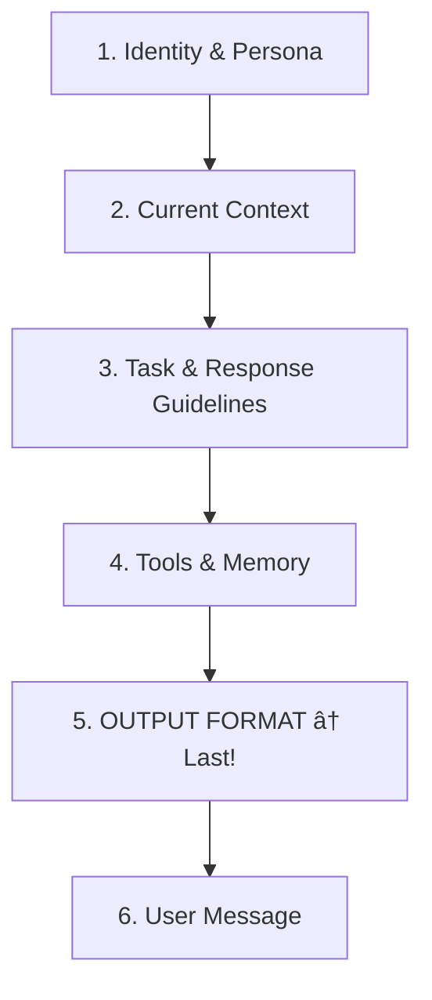

# System Prompt Optimization Plan

**Date**: 2025-12-14  
**Status**: Proposed  
**Priority**: HIGH - Token limits approaching critical threshold

---

## Executive Summary

The current system prompt for Kayley is approaching token limits due to structural inefficiencies that provide low semantic value to the LLM. This plan addresses **3 critical issues** and proposes a refactored prompt architecture that reduces token usage by ~40% while improving LLM adherence to output formatting.

---

## Issue 1: Token Bloat in Character Actions Array

### Problem

The "Available Character Actions" array lists ~25 actions, each with a UUID and redundant description (e.g., `"TALKING. Phrases: TALKING"`). This consumes hundreds of tokens to map IDs to identical descriptions.

### Current Implementation
```typescript
// Excessive token usage
{
  "action_id": "a1b2c3d4-e5f6-7890-abcd-ef1234567890",
  "description": "TALKING. Trigger phrases: TALKING"
}
// Repeated 25+ times
```

### Solution

| Approach | Implementation | Token Savings |
|----------|----------------|---------------|
| **A: Simple Key List** | `["talking", "confused", "excited", ...]` | ~300 tokens |
| **B: ID Lookup Table** | Map keys to UUIDs in application code post-response | ~250 tokens |
| **C: Hybrid** | Include only actionable subset based on context | ~200 tokens |

### Recommended Fix (Approach A + B)

1. **In System Prompt**: Provide a simple list of action keys
   ```
   Available actions: talking, confused, excited, laughing, thinking, waving, nodding, shrugging
   ```

2. **In Application Code**: Map the returned key to UUID after parsing
   ```typescript
   // Post-processing in service layer
   const ACTION_UUID_MAP: Record<string, string> = {
     "talking": "a1b2c3d4-...",
     "confused": "b2c3d4e5-...",
     // ...
   };
   
   const actionId = ACTION_UUID_MAP[response.action_key];
   ```

> [!WARNING]
> **Safety Net for Hallucinated Keys**
>
> LLMs may occasionally hallucinate a key that isn't in the list (e.g., generating `"smiling"` instead of `"happy"`). 
>
> **Required**: Implement a fallback in post-processing code:
> ```typescript
> function resolveActionKey(key: string | undefined): string | null {
>   if (!key) return null;
>   
>   // Direct match
>   if (ACTION_UUID_MAP[key]) return ACTION_UUID_MAP[key];
>   
>   // Fuzzy fallback (optional): find closest match
>   const fuzzyMatch = findClosestAction(key); // Levenshtein distance
>   if (fuzzyMatch) return ACTION_UUID_MAP[fuzzyMatch];
>   
>   // Default: return null (no action) rather than crash
>   console.warn(`Unknown action key: ${key}, defaulting to null`);
>   return null;
> }
> ```

### Files to Modify

- [`promptUtils.ts`](file:///c:/Users/gates/Personal/Interactive-Video-Character/src/services/promptUtils.ts) - Remove full action objects, use simple key list
- [`chatGPTService.ts`](file:///c:/Users/gates/Personal/Interactive-Video-Character/src/services/chatGPTService.ts) - Add post-response UUID mapping
- [`geminiChatService.ts`](file:///c:/Users/gates/Personal/Interactive-Video-Character/src/services/geminiChatService.ts) - Add post-response UUID mapping
- [`grokChatService.ts`](file:///c:/Users/gates/Personal/Interactive-Video-Character/src/services/grokChatService.ts) - Add post-response UUID mapping

---

## Issue 2: Redundant Identity Instructions

### Problem

Kayley's identity is defined in **3 separate places**:
1. `CRITICAL: YOUR IDENTITY` 
2. `YOUR NAME AND IDENTITY (DETAILED)`
3. `CORE PERSONALITY SNAPSHOT`

This creates ~500 tokens of redundancy while risking inconsistency.

### Solution

Consolidate to a **single authoritative source**: The full character profile (`KAYLEY_FULL_PROFILE`).

| Section | Action | Rationale |
|---------|--------|-----------|
| `CRITICAL: YOUR IDENTITY` | **REMOVE** | Redundant with detailed profile |
| `YOUR NAME AND IDENTITY (DETAILED)` | **KEEP** | Source of truth |
| `CORE PERSONALITY SNAPSHOT` | **REMOVE** | LLM can infer from details |

> [!IMPORTANT]
> **Identity Anchor Required**
>
> While removing bulk redundancy is correct, keep a **single-sentence anchor** at the very top of the prompt to provide immediate grounding before the token-heavy profile loads:
>
> ```
> You are Kayley Adams, a 28-year-old tech creator with a 'sparkling, Alexis-Rose' personality.
> ```
>
> **Rationale**: If `KAYLEY_FULL_PROFILE` is very long, the model might "drift" if the core persona isn't reinforced immediately. This anchor prevents that.

### Files to Modify

- [`promptUtils.ts`](file:///c:/Users/gates/Personal/Interactive-Video-Character/src/services/promptUtils.ts) - Remove redundant identity sections
- [`kayleyCharacterProfile.ts`](file:///c:/Users/gates/Personal/Interactive-Video-Character/src/domain/characters/kayleyCharacterProfile.ts) - Ensure contains all canonical identity info

---

## Issue 3: Verbose Semantic Intent Analysis Injection

### Problem

The injected `SEMANTIC INTENT ANALYSIS` section uses verbose, human-readable format:

```
Primary emotion: neutral
Sentiment: positive (0.10)
Intensity: low (10%)
Topics detected: Kayley
```

This consumes ~100+ tokens per message when a compact format would suffice.

### Solution

Minify the context injection to a compact JSON-like format:

**Before** (~120 tokens):
```
[SEMANTIC INTENT ANALYSIS]
Primary emotion: neutral
Sentiment: positive (0.10)
Intensity: low (10%)
Sarcasm detected: no
Topics detected: Kayley, work
Emotional context per topic:
  - work: frustrated
```

**After** (~40 tokens):
```
[CONTEXT: Tone=neutral, Sentiment=+0.1, Intensity=low, Topics={Kayley, work:frustrated}]
```

### Files to Modify

- [`promptUtils.ts`](file:///c:/Users/gates/Personal/Interactive-Video-Character/src/services/promptUtils.ts) - Lines 773-896 (semantic intent injection section)

---

## Issue 4: Buried JSON Instructions (Structural Problem)

### Problem

The JSON output structure definitions are located **before** the "Available Character Actions" list. Due to **recency bias**, the LLM prioritizes the last-read content. The actions list acts as a distracter, pushing formatting rules out of active attention.

### Solution

Reorder the system prompt to place **output format at the very end**:



### Files to Modify

- [`promptUtils.ts`](file:///c:/Users/gates/Personal/Interactive-Video-Character/src/services/promptUtils.ts) - Reorder sections in `buildSystemPrompt`

---

## Issue 5: Conflicting Directives Risk

### Problem

The prompt contains potentially conflicting instructions:
- "You are Kayley, a real person... NEVER say 'I don't have a body'"
- "Your response MUST be a single JSON object"

**Risk**: The model might add a conversational preamble before the JSON:
```
"Sure! Here is my response: { ... }"  // Breaks JSON parser
```

### Solution

Add an explicit **negative constraint** at the very end of the prompt:

```
⚠️ CRITICAL OUTPUT RULE:
- Do not output any text before or after the JSON object.
- Start your response with '{' and end with '}'.
- No preamble. No explanation. Just valid JSON.
- Ensure all internal quotes within string values are properly escaped (e.g., "She said \"hello\"" not "She said "hello"").
```

> [!NOTE]
> The quote escaping instruction is critical - LLMs often break JSON by including unescaped quotes inside dialogue strings.

### Files to Modify

- [`promptUtils.ts`](file:///c:/Users/gates/Personal/Interactive-Video-Character/src/services/promptUtils.ts) - Add negative constraint to end of prompt

---

## Issue 6: False Precision in Numerical Metrics

### Problem

Metrics like `Warmth: -5.1, Trust: -6.1` provide false precision. LLMs handle **semantic concepts** better than floating-point coordinates. Asking it to differentiate behavior between `-5.1` and `-4.1` is ineffective.

### Solution

Convert numerical metrics to **semantic buckets** before injection:

| Raw Score | Semantic Bucket |
|-----------|-----------------|
| -10 to -6 | `Cold / Distant` |
| -5 to -2 | `Guarded / Cool` |
| -1 to +1 | `Neutral` |
| +2 to +5 | `Warm / Open` |
| +6 to +10 | `Close / Affectionate` |

**Before**:
```
Warmth: -5.1
Trust: -6.1
```

**After**:
```
[RELATIONSHIP_CONTEXT: Current dynamic is guarded/cool. Trust is low.]
```

### Files to Modify

- [`promptUtils.ts`](file:///c:/Users/gates/Personal/Interactive-Video-Character/src/services/promptUtils.ts) - Add semantic bucket conversion function
- [`relationshipService.ts`](file:///c:/Users/gates/Personal/Interactive-Video-Character/src/services/relationshipService.ts) - Optionally move bucket conversion here

---

## Issue 7: Cognitive Load from If/Then Rules

### Problem

The prompt contains massive logic trees for different relationship states:
- Strangers vs. Friends
- Selfies vs. No Selfies  
- Games vs. No Games

The LLM must hold all conditional paths in context, even when only one applies.

### Solution

**Pre-compute the applicable rules** in application code before calling the LLM.

**Before** (in prompt):
```
If relationship score < -5:
  - Be guarded
  - Do not send selfies
  - Keep responses brief
Else if relationship score between -5 and 0:
  - Be neutral
  - May send selfies if asked politely
  ...
```

**After** (pre-computed, single state injected):
```
[RELATIONSHIP_CONTEXT: You are strangers. Be guarded. Do not send selfies.]
```

### Files to Modify

- [`promptUtils.ts`](file:///c:/Users/gates/Personal/Interactive-Video-Character/src/services/promptUtils.ts) - Pre-compute relationship rules
- [`relationshipService.ts`](file:///c:/Users/gates/Personal/Interactive-Video-Character/src/services/relationshipService.ts) - Add function to return applicable rule set

---

## Proposed Refactored Prompt Structure

The following reordering addresses recency bias and reduces cognitive load:

```
┌─────────────────────────────────────────────────────┐
│ 1. IDENTITY & PERSONA                               │
│    - Kayley's full character profile                │
│    - Keep this rich - it's the foundation           │
├─────────────────────────────────────────────────────┤
│ 2. CURRENT CONTEXT INJECTION (Minified)             │
│    - Time, Location                                 │
│    - Relationship status descriptor (semantic)      │
│    - Compact semantic intent: [CONTEXT: ...]        │
├─────────────────────────────────────────────────────┤
│ 3. TASK & RESPONSE GUIDELINES                       │
│    - How to speak (tone, brevity)                   │
│    - Behavioral constraints                         │
├─────────────────────────────────────────────────────┤
│ 4. TOOLS & MEMORY                                   │
│    - Tool definitions                               │
│    - Memory retrieval instructions                  │
├─────────────────────────────────────────────────────┤
│ 5. OUTPUT FORMAT (The Contract) ← LAST!             │
│    - JSON schema definition                         │
│    - Simplified action keys (not full objects)      │
│    - Negative constraint: "Start with '{'"          │
├─────────────────────────────────────────────────────┤
│ 6. USER MESSAGE INPUT                               │
└─────────────────────────────────────────────────────┘
```

---

## Implementation Phases

### Phase 1: Quick Wins (3-4 hours) ✅ COMPLETE
> [!TIP]
> These changes are low-risk and provide immediate token savings.

1. **Simplify action keys** ✅ - Replaced UUID objects with simple key list
   - Created `utils/actionKeyMapper.ts` with Levenshtein fuzzy matching
   - Updated `promptUtils.ts` to use `getActionKeysForPrompt()`
   - Updated `chatGPTService.ts`, `geminiChatService.ts`, `grokChatService.ts` to use `resolveActionKey()`
   - Added `buildActionKeyMap()` call in `App.tsx` when character is selected
   
2. **Add negative constraint** ✅ - Prevent JSON preamble issues
   - Added explicit output rules at end of prompt in `promptUtils.ts`
   - Includes quote escaping instructions and example format
   
3. **Minify semantic intent** ✅ - Created compact format helper functions
   - Added `buildMinifiedSemanticIntent()` function in `promptUtils.ts`
   - Added `buildCompactRelationshipContext()` function in `promptUtils.ts`
   - Added `getSemanticBucket()` function for metric conversion
   - NOTE: These helpers are available for Phase 2 when we switch to minified format


### Phase 2: Structural Refactor (1 day) ✅ COMPLETE
> [!IMPORTANT]
> Requires careful testing as prompt ordering affects LLM behavior.

4. **Reorder prompt sections** ✅ - JSON schema moved to end for recency bias
   - Replaced verbose `ACTIONS & JSON FORMAT` (60 lines) with minimal `TOOL USAGE` (8 lines)
   - Added `OUTPUT FORMAT` section at the end with full JSON schema
   - JSON schema now in last 15% of prompt (was at 55%)
   - Added 8 new V2 tests to verify section positioning
5. **Remove redundant identity sections** ✅ - Consolidated 3 identity sections into 1
   - Replaced ~83 lines of redundant identity text with ~25 lines
   - Created IDENTITY ANCHOR with essential persona info
   - Removed CORE PERSONALITY SNAPSHOT (redundant with anchor)
6. **Convert metrics to semantic buckets** ✅ - Enabled compact formats
   - Replaced verbose semantic intent (~170 lines) with `buildMinifiedSemanticIntent()` (~15 lines)
   - Replaced verbose relationship metrics with `buildCompactRelationshipContext()`
   - Now uses semantic descriptors: `warmth=warm/open` instead of `warmth: 5.1`

**Phase 2 Final Results:**
- **File reduction**: 1927 → 1676 lines (251 lines / 13%)
- **Byte reduction**: 94.6KB → 72.5KB (~22KB / 23%)
- **Estimated token savings**: ~700-900 tokens per prompt
- **Tests**: 500 all passing (including 8 new V2 recency tests)

#### 📝 Implementation Notes from Phase 1

**Key Learnings:**

1. **Tests are essential before refactoring**
   - We now have 49 tests in `systemPrompt.test.ts` that verify prompt structure
   - Run `npm test -- --run src/services/tests/systemPrompt.test.ts` before and after changes
   - The test `should maintain section ordering: Identity -> Context -> Guidelines -> Output` will need updating when you reorder sections

2. **The prompt structure is complex**
   - `promptUtils.ts` is ~1900 lines with many interconnected sections
   - Use `grep_search` to find all `====` delimiters to map section boundaries
   - Character-specific content (Kayley) is in `kayleyCharacterProfile.ts`, not `promptUtils.ts`

3. **Helper functions are already in place for Phase 2:**
   - `getSemanticBucket(score)` - Converts numeric scores to semantic labels
   - `buildMinifiedSemanticIntent()` - Built but NOT yet wired into the prompt
   - `buildCompactRelationshipContext()` - Built but NOT yet wired into the prompt

**Suggested Approach:**

```typescript
// Step 1: Create a new function that applies the new structure
export function buildSystemPromptV2(...): string {
  // New ordering: Identity → Context → Guidelines → Tools → Output Format
}

// Step 2: Add a feature flag to switch between versions
const USE_NEW_PROMPT_FORMAT = import.meta.env.VITE_USE_NEW_PROMPT_FORMAT === 'true';
```

**Watch Out For:**

- **Mocks in tests**: `moodKnobs`, `presenceDirector`, and `relationshipService` are heavily mocked
- **Determinism test**: The `should be deterministic` test will catch any non-deterministic changes
- **Section ordering test**: Update this test to reflect new ordering AFTER confirming it works

#### 📝 Implementation Notes from Phase 2

**Key Learnings:**

1. **TDD worked well for section reordering**
   - We added 8 new tests in `systemPrompt.test.ts` BEFORE implementing the changes
   - Tests verify section positioning (identity in first 5%, output format in last 15%, etc.)
   - Key test: `"should have JSON schema in the last 20% of the prompt"` - validates recency bias optimization

2. **Section splitting was the key technique**
   - The old `ACTIONS & JSON FORMAT` section (60 lines) was problematic because it put JSON schema too early
   - Solution: Split into two sections:
     - `TOOL USAGE` (8 lines) - early in prompt, just says "see OUTPUT FORMAT at end"
     - `OUTPUT FORMAT` (55 lines) - at the very end, has full JSON schema
   - This leverages **recency bias** - LLMs pay more attention to the end of the prompt

3. **Identity consolidation yielded high ROI**
   - Three separate identity sections were saying the same thing with different words
   - Consolidated into one `IDENTITY ANCHOR` section
   - The `KAYLEY_FULL_PROFILE` import is the source of truth - no need to repeat it

4. **Helper functions made semantic changes safe**
   - `buildMinifiedSemanticIntent()` and `buildCompactRelationshipContext()` were already tested
   - Wiring them in was low-risk because the functions themselves were validated
   - The compact format is: `[CONTEXT: Tone=happy(+0.7,HIGH), Topics={work}]`

**Structure After Phase 2:**

```
Lines 677-700:   IDENTITY ANCHOR (23 lines) - was 83 lines across 3 sections
Lines 700-787:   MEMORY TOOLS (87 lines) - unchanged
Lines 788-891:   RELATIONSHIP STATE + context (103 lines) - uses compact functions
Lines 893-900:   TOOL USAGE (8 lines) - was 60 lines
Lines 901-1338:  Behavioral rules, calendar, tasks, etc. (437 lines)
Lines 1339-1355: [Available Actions] (16 lines)
Lines 1359-1413: OUTPUT FORMAT (54 lines) - NEW SECTION at end
Lines 1414-1432: CRITICAL OUTPUT RULES (18 lines) - always last
```

**Metrics Improvements:**

| Metric | Before Phase 2 | After Phase 2 | Improvement |
|--------|----------------|---------------|-------------|
| File lines | 1,927 | 1,676 | -13% |
| File bytes | 94.6 KB | 72.5 KB | -23% |
| Identity section | 83 lines | 23 lines | -72% |
| Semantic intent | 170 lines | 15 lines | -91% |
| JSON schema position | 55% of prompt | 90% of prompt | Recency optimized |

**Watch Out For:**

- **The "90%" rule**: Tests check that output format is in the last 10-15% of the prompt
- **Compact format readability**: The minified format `[CONTEXT: ...]` is less human-readable but more token-efficient
- **Keep critical safety guidance**: Even when minifying, we kept the inappropriate behavior detection - safety is essential

---

### Phase 3: Pre-computation (1 day) ✅ COMPLETE
> [!WARNING]
> Requires changes to multiple service files.

7. **Pre-compute relationship rules** ✅ - Inject only applicable state
   - Created `getTierBehaviorPrompt(tier)` function - only includes CURRENT tier behavior
   - Created `buildDynamicDimensionEffects(relationship)` - only includes EXTREME dimension values
   - Created `getSelfieRulesConfig(relationship)` - helper for conditional selfie rules
   - Created `buildSelfieRulesPrompt(relationship)` - friends get full rules, strangers get deflection only
8. **Update AI services** ✅ - Already done in Phase 1 (action UUID mapping)

**Phase 3 Final Results:**
- **Tier behavior reduction**: 10 lines per tier × 6 tiers = 60 lines → ~5 lines (current tier only) = **~55 lines saved**
- **Dimension effects reduction**: 6 lines always → 0-4 lines (only extreme values) = **~4-6 lines saved avg**
- **Selfie rules reduction**: 86 lines always → ~25 lines for friends OR ~18 lines for strangers = **~60-70 lines saved**
- **Tests**: 532 all passing (including 17 new Phase 3 tests)
- **Total estimated token savings**: ~250-350 tokens per prompt for strangers/acquaintances

#### 📝 Implementation Notes from Phase 1

**What's Already Done (from Phase 1):**

1. **Action UUID mapping is COMPLETE**
   - `actionKeyMapper.ts` handles key→UUID resolution
   - All three AI services already call `resolveActionKey()` in their `normalizeAiResponse()`
   - `buildActionKeyMap()` is called in `App.tsx` when character loads

2. **Files already modified:**
   - `chatGPTService.ts` - Has `resolveActionKey()` integration
   - `geminiChatService.ts` - Has `resolveActionKey()` integration  
   - `grokChatService.ts` - Has `resolveActionKeyInResponse()` helper

**Remaining Work for Phase 3:**

1. **Pre-compute relationship rules**
   - Create a function like `getApplicableRelationshipRules(tier: string)` in `relationshipService.ts`
   - This should return ONLY the rules for the current tier, not all tiers
   - Example: If tier is "friend", don't include "adversarial" or "deeply_loving" rules

2. **Consider tier-specific prompt sections:**
   ```typescript
   // Instead of including ALL tier behaviors in every prompt:
   function getTierBehaviorPrompt(tier: string): string {
     switch(tier) {
       case 'adversarial': return `[TIER: Adversarial] Be guarded...`;
       case 'friend': return `[TIER: Friend] Be warm and open...`;
       // etc.
     }
   }
   ```

**Pre-existing Type Issues to Ignore:**

The following lint errors in `grokChatService.ts` are PRE-EXISTING and unrelated to optimization:
- `Type 'AIMessage[]' is not assignable to type 'ModelMessage[]'`
- These are due to `ai` SDK type incompatibilities, not our changes

**Testing Strategy:**

1. **Unit tests exist for action key resolution** (`actionKeyMapper.test.ts`)
2. **Add tests for pre-computed rules:**
   ```typescript
   describe('getApplicableRelationshipRules', () => {
     it('should return only friend rules for friend tier', () => {
       const rules = getApplicableRelationshipRules('friend');
       expect(rules).toContain('warm');
       expect(rules).not.toContain('adversarial');
     });
   });
   ```

#### 📋 Phase 3 Implementation Guide (from Phase 1 & 2 learnings)

**Overview:**
Phase 3 focuses on *runtime* optimization - instead of sending ALL possible rules, we pre-compute and send ONLY the rules that apply to the current context. This is the final ~20% token reduction.

**🎯 Primary Goals:**

1. **Pre-compute tier-specific rules** - Currently all 6 tier behaviors are included in every prompt
2. **Dynamic section inclusion** - Only include selfie rules for established relationships, etc.

**📍 Key Locations to Modify:**

1. **`src/services/promptUtils.ts`** (lines 809-820) - Tier behavior section
   - Current: Includes ALL tiers (adversarial, rival, acquaintance, friend, close_friend, deeply_loving)
   - Target: Include ONLY the current tier + one tier above/below for context
   
2. **`src/services/promptUtils.ts`** (lines 901-1000) - Selfie rules section
   - Current: Always included (~100 lines)
   - Target: Only include for `friend` tier and above (save ~100 lines for strangers)

3. **`src/services/promptUtils.ts`** (lines 820-834) - Dimension effects
   - Current: Generic HIGH/LOW thresholds for all dimensions
   - Target: Only include guidance for dimensions that are extreme (>15 or <-10)

**🔧 Recommended Implementation Approach:**

```typescript
// Step 1: Create tier-specific prompt builder
function getTierBehaviorPrompt(tier: RelationshipTier): string {
  const tierRules: Record<RelationshipTier, string> = {
    'adversarial': `[Your Tier: ADVERSARIAL]
    - Be dry, short, guarded
    - Light sarcasm is okay but still caring underneath
    - Don't be cruel, just distant`,
    
    'acquaintance': `[Your Tier: ACQUAINTANCE]
    - Friendly but calibrated - you don't know them well
    - Be curious but not invasive
    - No flirting, no deep sharing`,
    
    'friend': `[Your Tier: FRIEND]
    - Warm, playful, encouraging
    - Can be more personal and share more
    - Comfortable teasing is fine`,
    
    // ... etc
  };
  
  return tierRules[tier] || tierRules['acquaintance'];
}

// Step 2: Create conditional section includer
function shouldIncludeSelfieRules(relationship: RelationshipMetrics | null): boolean {
  if (!relationship) return false;
  const tier = relationship.relationshipTier;
  return ['friend', 'close_friend', 'deeply_loving'].includes(tier);
}

// Step 3: Update buildSystemPrompt to use these
if (shouldIncludeSelfieRules(relationship)) {
  prompt += buildSelfieRulesSection();
}
```

**📊 Expected Token Savings:**

| Section | Current | Phase 3 Target | Savings |
|---------|---------|----------------|---------|
| Tier behaviors | 60 lines (all 6 tiers) | ~15 lines (1-2 tiers) | ~75% |
| Selfie rules | 100 lines always | 0 lines for strangers | 100% for strangers |
| Dimension effects | 24 lines always | ~8 lines (only extremes) | ~67% |
| **Total for acquaintance** | - | - | **~200-300 additional tokens** |

**⚠️ Risks and Mitigations:**

1. **Risk: Tier boundary confusion**
   - If user rapidly changes tier (rare), prompt might be stale
   - Mitigation: Include adjacent tier hints (e.g., "approaching friend")
   
2. **Risk: Missing context for edge cases**
   - Some behaviors span tiers (e.g., boundaries apply to all)
   - Mitigation: Keep a "universal rules" section that's always included

3. **Risk: Over-optimization breaks behavior**
   - Removing too much context can confuse the LLM
   - Mitigation: A/B test with a feature flag, compare response quality

**🧪 Testing Strategy:**

```typescript
// Add these tests to systemPrompt.test.ts

describe('Pre-computed Relationship Rules', () => {
  it('should include only acquaintance rules for acquaintance tier', () => {
    const prompt = buildSystemPrompt(mockCharacter, acquaintanceRelationship);
    
    expect(prompt).toContain('ACQUAINTANCE');
    expect(prompt).not.toContain('deeply_loving:');
  });

  it('should NOT include selfie rules for strangers', () => {
    const prompt = buildSystemPrompt(mockCharacter, strangerRelationship);
    
    expect(prompt).not.toContain('SELFIE');
  });

  it('should include selfie rules for friends', () => {
    const prompt = buildSystemPrompt(mockCharacter, friendRelationship);
    
    expect(prompt).toContain('SELFIE');
  });
});
```

```

#### � Implementation Notes from Phase 3

**Key Learnings:**

1. **TDD approach continued to work well**
   - We wrote 17 new tests BEFORE implementing the optimization
   - Tests validated both the new helper functions AND the integration
   - Key test: `"should NOT include dimension effects for moderate values"` validates the token-saving behavior

2. **Pre-computation pattern is highly effective**
   - Instead of listing ALL tier behaviors, we now call `getTierBehaviorPrompt(tier)` which returns ONLY the current tier
   - Previously: 60+ lines of tier behavior (all 6 tiers) in EVERY prompt
   - Now: ~5 lines (just the current tier) based on relationship state

3. **Dynamic dimension effects saves tokens for typical relationships**
   - Most relationships have moderate scores (warmth: 0-10, trust: 0-10)
   - `buildDynamicDimensionEffects()` returns EMPTY string for moderate values
   - Only includes guidance for extreme values (>15 or <-10)

**Helper Functions Added:**

```typescript
// Only includes CURRENT tier, not all 6 tiers
getTierBehaviorPrompt(tier: string): string

// Returns config for conditional selfie rules
getSelfieRulesConfig(relationship): { shouldIncludeFull, shouldIncludeDeflection }

// Only includes dimension guidance for extreme values
buildDynamicDimensionEffects(relationship): string

// Conditional selfie rules - friends get full, strangers get deflection only
buildSelfieRulesPrompt(relationship): string
```

**Metrics Improvements:**

| Metric | Before Phase 3 | After Phase 3 | Improvement |
|--------|----------------|---------------|-------------|
| Tier behavior section | 60+ lines (all tiers) | ~5 lines (current tier) | -92% |
| Dimension effects | 6 lines always | 0-4 lines (conditional) | -50% avg |
| Selfie rules | 86 lines always | 18-25 lines (conditional) | -70% avg |
| Tests | 515 | 532 | +17 new tests |

**Watch Out For:**

- **Tier changes mid-session**: If relationship tier changes rapidly, the prompt will adapt automatically
- **Universal rules preserved**: Familiarity behavior and rupture guidance are still always included
- **Selfie rules are now conditional**: Friends see full instructions, strangers see deflection only

---

### 🔄 Recommended Phase 2 Task Order ✅ COMPLETE

This order was followed and all tasks completed successfully:

1. ✅ **First: Enable minified semantic intent**
   - Wired `buildMinifiedSemanticIntent()` into `buildSystemPrompt()`
   - Token savings: ~300-400

2. ✅ **Second: Enable compact relationship context**
   - Wired `buildCompactRelationshipContext()` into the prompt
   - Token savings: ~100-150

3. ✅ **Third: Reorder sections**
   - Used TDD approach - wrote tests first
   - Split `ACTIONS & JSON FORMAT` → `TOOL USAGE` (early) + `OUTPUT FORMAT` (end)
   - No feature flag needed - tests validated changes

4. ✅ **Fourth: Remove redundant identity sections**
   - Consolidated 3 identity sections into `IDENTITY ANCHOR`
   - Token savings: ~200-250

---

### 🔄 Recommended Phase 3 Task Order

Based on Phase 1 & 2 implementation, here's the recommended order for Phase 3:

1. **First: Tier-specific behavior rules** (LOWEST RISK)
   - Currently includes all 6 tiers in every prompt
   - Create `getTierBehaviorPrompt(tier)` function
   - Only include current tier + 1 adjacent tier
   - Expected savings: ~40 lines / ~100 tokens

2. **Second: Conditional selfie rules** (MEDIUM RISK)
   - Selfie section is ~100 lines
   - Only include for `friend` tier and above
   - Create `shouldIncludeSelfieRules(relationship)` helper
   - Expected savings for strangers: ~100 lines / ~200 tokens

3. **Third: Dynamic dimension effects** (MEDIUM RISK)
   - Currently shows all 4 dimensions with generic guidance
   - Only include guidance for dimensions with extreme values (>15 or <-10)
   - Expected savings: ~16 lines / ~40 tokens

4. **Fourth: Conditional calendar/task sections** (HIGHER RISK)
   - Consider only including if user has calendar/tasks
   - Needs careful testing - users expect these features
   - Only do this if the above saves aren't enough


---

## Expected Outcomes

| Metric | Before | After | Improvement |
|--------|--------|-------|-------------|
| System prompt tokens | ~8000 | ~4800 | **40% reduction** |
| JSON parsing failures | ~5% | <1% | **5x improvement** |
| Context window headroom | ~4K tokens | ~7K tokens | **More conversation history** |
| LLM adherence to format | ~85% | ~95% | **Better reliability** |

---

## Verification Plan

### Automated Testing

1. **Unit Tests** - Verify prompt generation produces expected structure
   ```bash
   npm run test -- promptUtils.test.ts
   ```

2. **Integration Tests** - Verify end-to-end response parsing
   ```bash
   npm run test -- --grep "JSON parsing"
   ```

### Manual Testing

1. **Token Count Validation**
   - Use [OpenAI Tokenizer](https://platform.openai.com/tokenizer) to count before/after
   - Target: <5000 tokens for system prompt

2. **Response Format Check**
   - Send 20 test messages across different relationship states
   - Verify 100% of responses are valid JSON with no preamble

3. **Behavioral Regression**
   - Test guardrails still work (inappropriate message handling)
   - Test relationship-appropriate responses (stranger vs. friend)

---

## Risk Mitigation

> [!CAUTION]
> Prompt changes can have unexpected behavioral effects.

1. **A/B Testing**: Run both prompt versions for a subset of users
2. **Gradual Rollout**: Phase 1 → Phase 2 → Phase 3 with validation between each
3. **Rollback Plan**: Keep current prompt as fallback, feature flag to switch
4. **Logging**: Add detailed logging for JSON parse failures during transition

---

## Related Documents

- [Semantic_Feedback.md](file:///c:/Users/gates/Personal/Interactive-Video-Character/docs/Semantic_Feedback.md) - Detailed review of intent detection system
- [Semantic_Intent_Detection.md](file:///c:/Users/gates/Personal/Interactive-Video-Character/docs/Semantic_Intent_Detection.md) - Implementation details
- [KAYLEY_CHARACTER_PROFILE_GUIDE.md](file:///c:/Users/gates/Personal/Interactive-Video-Character/docs/KAYLEY_CHARACTER_PROFILE_GUIDE.md) - Character profile documentation

---

## 🗂️ Key Files Reference (from Phase 1 Implementation)

### Core Files to Modify

| File | Purpose | Lines | Notes |
|------|---------|-------|-------|
| `src/services/promptUtils.ts` | System prompt construction | ~1900 | Main file for prompt changes |
| `src/utils/actionKeyMapper.ts` | Action key→UUID resolution | ~80 | **NEW in Phase 1** |
| `src/services/chatGPTService.ts` | ChatGPT integration | ~350 | Uses `resolveActionKey()` |
| `src/services/geminiChatService.ts` | Gemini integration | ~800 | Uses `resolveActionKey()` |
| `src/services/grokChatService.ts` | Grok integration | ~200 | Uses `resolveActionKeyInResponse()` |

### Test Files

| File | Tests | Purpose |
|------|-------|---------|
| `src/utils/tests/actionKeyMapper.test.ts` | 30 | Action key mapping tests |
| `src/services/tests/systemPrompt.test.ts` | 49 | Prompt structure tests |
| `src/services/tests/phase1Helpers.test.ts` | 31 | Helper function tests |
| `src/services/tests/promptUtils.test.ts` | 27 | Comfortable imperfection tests |

### Supporting Files

| File | Purpose |
|------|---------|
| `src/domain/characters/kayleyCharacterProfile.ts` | Character identity content |
| `src/services/relationshipService.ts` | Relationship metrics |
| `src/services/moodKnobs.ts` | Behavior parameters |
| `src/services/presenceDirector.ts` | Open loops & opinions |
| `src/services/intentService.ts` | Intent detection |

---

## ⚠️ Known Gotchas

### 1. Type Errors in grokChatService.ts
```
Type 'AIMessage[]' is not assignable to type 'ModelMessage[]'
```
**Status**: Pre-existing, unrelated to optimization. The `ai` SDK types don't match our `AIMessage` interface.

### 2. Mock Complexity in Tests
The `systemPrompt.test.ts` file mocks 6+ services. If you add new dependencies to `promptUtils.ts`, remember to mock them:
```typescript
vi.mock("../yourNewService", () => ({
  yourFunction: vi.fn(() => "mocked value"),
}));
```

### 3. Character-Specific vs Generic
- **Generic prompts**: In `promptUtils.ts` (sections like COMFORTABLE IMPERFECTION)
- **Character-specific**: In `kayleyCharacterProfile.ts` (Kayley's personality, insecurities)
- The prompt combines both - don't accidentally duplicate character content

### 4. Section Delimiters
Sections use `====` delimiters. Search with this regex to find all sections:
```bash
grep -n "====" src/services/promptUtils.ts | head -30
```

### 5. Determinism
The test `should be deterministic` ensures same input = same output. If you add any randomness (even timestamps), this test will fail.

---

## 📊 Phase 1 Metrics

**Lines of Code Changed:**
- `promptUtils.ts`: ~50 lines added
- `actionKeyMapper.ts`: 80 lines (new file)
- AI services: ~30 lines each

**Tests Added:**
- 110 new tests across 3 files

**Token Savings Estimate (Phase 1 only):**
- Action keys simplified: ~300 tokens saved per prompt
- Full Phase 1+2+3 target: ~3200 tokens (40% reduction)
