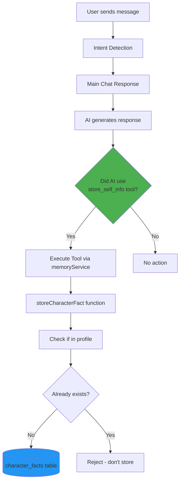
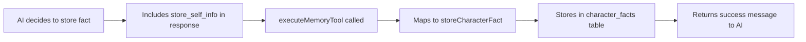

# Character Facts Service

**File:** `src/services/characterFactsService.ts`
**Table:** `character_facts`
**Purpose:** Stores emergent facts about Kayley (the character) that arise during conversations but aren't in her static profile

> **🔄 Updated:** Pattern-based detection has been removed. Character facts are now stored exclusively via the `store_self_info` LLM tool, providing more accurate and context-aware fact capture.

---

## Overview

The Character Facts Service manages Kayley's evolving knowledge about herself. As she interacts with users, she can learn and remember new details about her life, preferences, and experiences that weren't originally in her character profile.

### Key Concept

> **Profile vs. Facts**: Kayley's character profile (`kayleyCharacterProfile.ts`) contains her core identity. Character facts store *new* information she creates during conversations - like naming her plant "Penelope" or mentioning she tried a new coffee shop.

---

## Table Schema

```sql
CREATE TABLE character_facts (
  id UUID PRIMARY KEY,
  character_id TEXT DEFAULT 'kayley',
  category TEXT CHECK (category IN ('quirk', 'relationship', 'experience', 'preference', 'detail', 'other')),
  fact_key TEXT NOT NULL,          -- e.g., 'plant_name_penelope'
  fact_value TEXT NOT NULL,        -- e.g., 'Penelope'
  source_message_id TEXT,          -- Optional conversation reference
  confidence NUMERIC DEFAULT 1.0,  -- 0.0 to 1.0
  created_at TIMESTAMP,
  updated_at TIMESTAMP,
  UNIQUE(character_id, category, fact_key)
);
```

### Categories

| Category | Description | Examples |
|----------|-------------|----------|
| `quirk` | Habits, personality traits | "straightened/sleek hair vibe", "thinks breaking the internet is hilarious" |
| `experience` | Stories, events, memories | "bob haircut era in junior year", "21st birthday with neon blue drink" |
| `preference` | Likes, dislikes, favorites | "favorite toothpaste is Marvis", "wearing ears headband on hot girl walks" |
| `relationship` | Connections with user | "gym selfie pact with Steven", "secret lost kiss" |
| `detail` | Specific factual info | "plant named Penelope", "outfit on Jan 7, 2026" |
| `other` | Uncategorized | Fallback for edge cases |

---

## How Facts Get Saved

Character facts are stored exclusively through **LLM tool usage**. The AI actively decides when to store facts based on semantic understanding:



### LLM Tool Storage (Active Decision) 🟢

**When it happens:** The AI *actively decides* to store a fact using the `store_self_info` tool.

**Flow:**
1. During response generation, AI realizes it mentioned something new about Kayley
2. AI calls `store_self_info` tool with `category`, `key`, and `value`
3. Tool is executed via `executeMemoryTool()` in `memoryService.ts`
4. Maps to `storeCharacterFact()` in `characterFactsService.ts`
5. Fact is stored immediately (blocking)

**Example:**
```typescript
// AI's response includes:
{
  text_response: "I named my plant Penelope! She's a Fiddle Leaf Fig.",
  store_self_info: {
    category: "detail",
    key: "plant_name_penelope",
    value: "Penelope"
  }
}
```

**Advantages:**
- ✅ AI has full context and semantic understanding
- ✅ Can capture nuanced facts across any conversational style
- ✅ Reliable and accurate
- ✅ No maintenance burden (no regex patterns to update)
- ✅ Self-improving (benefits from LLM advances)

**Why This Approach:**
Previously, the system used regex pattern detection as a "safety net," but analysis showed it only caught ~5% of facts while the LLM tool handled 95%. Pattern detection has been removed to simplify the codebase and rely on the more powerful semantic understanding of the LLM.

---

## Historical Note: Pattern Detection (Removed 2026-01-13)

**What was removed:** Regex-based pattern detection that ran in the background after every AI response.

**Why it was removed:**
- Only caught 4 specific patterns (laptop/camera names, friends, preferences)
- Analysis showed it captured <5% of facts while LLM tool handled 95%
- Hard to maintain (brittle regex patterns)
- No semantic understanding of context

**What you might see in old code/docs:**
- `detectCharacterFacts()` - Regex matching function ❌ Removed
- `processAndStoreCharacterFacts()` - Background processor ❌ Removed
- Pattern arrays for device names, friends, etc. ❌ Removed

**Current approach:** Facts are stored exclusively via the `store_self_info` LLM tool, which provides semantic understanding and context-aware fact detection. This is simpler, more reliable, and requires no maintenance.

---

## Service Functions

### Core Database Operations

#### `getCharacterFacts(category?: CharacterFactCategory): Promise<CharacterFact[]>`

Retrieves all character facts, optionally filtered by category.

```typescript
// Get all facts
const allFacts = await getCharacterFacts();

// Get only preferences
const preferences = await getCharacterFacts('preference');
```

**Returns:**
```typescript
[
  {
    id: "uuid",
    character_id: "kayley",
    category: "detail",
    fact_key: "plant_name_penelope",
    fact_value: "Penelope",
    source_message_id: null,
    confidence: 1.0,
    created_at: "2025-12-27T04:16:04.888312+00",
    updated_at: "2025-12-27T04:16:10.458+00"
  }
]
```

---

#### `storeCharacterFact(category, key, value, sourceMessageId?, confidence?): Promise<boolean>`

Stores a new character fact or updates existing one.

**Validation Steps:**
1. ✅ Check if fact exists in character profile → Reject if found
2. ✅ Check if fact already stored → Reject if duplicate
3. ✅ Store to database with upsert (on conflict: character_id, category, fact_key)

```typescript
// Store a new fact
const success = await storeCharacterFact(
  'detail',
  'plant_name_penelope',
  'Penelope',
  'msg_123',
  1.0
);

// Returns: true if stored, false if duplicate/already in profile
```

**Console Output:**
```
💾 [CharacterFacts] Storing new fact: detail.plant_name_penelope = "Penelope"
✅ [CharacterFacts] Successfully stored fact: plant_name_penelope = "Penelope"
```

**Anti-Duplicate Protection:**
```typescript
// Example: "laptop" and "Nova" both appear in profile
if (isInCharacterProfile('laptop_name', 'Nova')) {
  console.log('📋 [CharacterFacts] Fact already in profile');
  return false; // Don't create duplicate
}
```

---

#### `formatCharacterFactsForPrompt(): Promise<string>`

Formats all facts for injection into the system prompt.

**Output Example:**
```markdown
## Additional Character Facts (from conversations)

### Specific Details
- **plant_name_penelope**: Penelope
- **plant_type_penelope**: Fiddle Leaf Fig

### Preferences
- **favorite_toothpaste**: Marvis (Whitening Mint) because the tubes are so aesthetic

### Experiences & Stories
- **bob_haircut_era**: Had a short, blunt bob during junior year of college
- **21st_birthday_memory**: Celebrated with Steven; neon blue drink
```

**Usage:** Called in `systemPromptBuilder.ts`:
```typescript
const [soulContext, characterFacts, userPatterns] = await Promise.all([
  getSoulLayerContextAsync(userId),
  formatCharacterFactsForPrompt(),
  formatUserPatternsForPrompt(userId)
]);

// Inject into prompt
prompt += characterFacts;
```

---

### ~~Detection Functions~~ (Removed - See Historical Note Above)

The following functions have been removed:
- `detectCharacterFacts()` - Regex pattern matching
- `processAndStoreCharacterFacts()` - Background processor

These functions are no longer part of the codebase. Facts are now stored exclusively via the `store_self_info` LLM tool.

---

## LLM Tool Integration

### `store_self_info` Tool (in `aiSchema.ts`)

**Schema:**
```typescript
store_self_info: z.object({
  category: z.enum(["quirk", "experience", "preference", "relationship", "detail"]),
  key: z.string().describe("A short, descriptive key (e.g., 'smoke_alarm_incident')"),
  value: z.string().describe("The fact to remember")
})
```

**Tool Execution Flow:**


**Example Usage by AI:**
```json
{
  "text_response": "I actually tried a new coffee shop today! Found this place called Brew & Co.",
  "action_id": null,
  "store_self_info": {
    "category": "experience",
    "key": "new_coffee_shop_brew_co",
    "value": "Tried Brew & Co coffee shop - really liked it"
  }
}
```

**Tool Rules (from `toolsAndCapabilities.ts`):**
```
**4. store_character_info(category, key, value)** - Remember YOUR facts
   When: You make up a new detail about yourself (plant name, new obsession, etc.)
   Categories: quirk, experience, preference, relationship, detail
   Example: "I named my cactus Spike!" → store_character_info("detail", "plant_name", "Spike")
   ⚠️ Only for NEW details - your core profile is already set.
```

---

## System Prompt Integration

Character facts are injected into every system prompt via `systemPromptBuilder.ts`:

```typescript
// src/services/system_prompts/builders/systemPromptBuilder.ts
const [soulContext, characterFacts, userPatterns, relationshipVulnerability] =
  await Promise.all([
    getSoulLayerContextAsync(userId),
    formatCharacterFactsForPrompt(), // ← Character facts
    formatUserPatternsForPrompt(userId),
    getRelationshipVulnerability(userId)
  ]);

// Later in prompt assembly:
${characterFacts}  // Injects formatted facts
```

**Result in Prompt:**
```
====================================================
YOUR CONTEXT (RIGHT NOW)
====================================================

[... mood, energy, etc ...]

## Additional Character Facts (from conversations)

### Specific Details
- **plant_name_penelope**: Penelope
- **plant_type_penelope**: Fiddle Leaf Fig

[... rest of prompt ...]
```

This ensures Kayley "remembers" details she's created in past conversations.

---

## Duplicate Prevention

### Profile Check: `isInCharacterProfile()`

Before storing any fact, checks if similar information exists in the static character profile.

**Implementation:**
```typescript
function isInCharacterProfile(factKey: string, factValue: string): boolean {
  const profileText = KAYLEY_FULL_PROFILE.toLowerCase();

  // 1. Check for exact value match with word boundaries
  const valueWords = factValue.toLowerCase().split(/\\s+/).filter(w => w.length > 2);
  if (valueWords.length <= 3) {
    const phrasePattern = new RegExp(`\\\\b${valueWords.join('\\\\s+')}\\\\b`, 'i');
    if (phrasePattern.test(KAYLEY_FULL_PROFILE)) {
      return true; // Value already in profile
    }
  }

  // 2. Check for key-related patterns
  const keyRelatedPatterns = {
    'laptop_name': [/laptop.*nova/i, /nova.*laptop/i],
    'friend': [/lena/i, /best friend/i],
    // ... more patterns
  };

  for (const [patternKey, patterns] of Object.entries(keyRelatedPatterns)) {
    if (keyLower.includes(patternKey)) {
      for (const pattern of patterns) {
        if (pattern.test(KAYLEY_FULL_PROFILE)) {
          return true; // Related info in profile
        }
      }
    }
  }

  return false;
}
```

**Example:**
```typescript
// Character profile says: "My laptop is named Nova"
isInCharacterProfile('laptop_name', 'Nova') // → true (reject)

// New info not in profile:
isInCharacterProfile('plant_name', 'Penelope') // → false (store)
```

---

## Real-World Usage Examples

### Example 1: Plant Name

**User conversation:**
```
User: What's your plant's name?
Kayley: I haven't named her yet, but I think I'll call her Penelope!
```

**What happens:**
1. ✅ AI recognizes it mentioned a new detail
2. ✅ Uses `store_self_info` tool:
   ```json
   {
     "category": "detail",
     "key": "plant_name_penelope",
     "value": "Penelope"
   }
   ```
3. ✅ `storeCharacterFact()` checks profile → Not found → Stores
4. ✅ Future conversations include "plant named Penelope" in prompt

---

### Example 2: Coffee Order

**User conversation:**
```
User: What's your usual coffee order?
Kayley: I've been obsessed with oat milk lattes lately!
```

**What happens:**
1. ✅ AI uses `store_self_info`:
   ```json
   {
     "category": "preference",
     "key": "coffee_order_oat_milk_latte",
     "value": "oat milk latte"
   }
   ```
2. ✅ Stored in database
3. ✅ Next time user asks, Kayley "remembers" this preference

---

### Example 3: Experience Story

**User conversation:**
```
Kayley: OMG I set off the smoke alarm making toast TWICE this week. I'm a disaster.
```

**What happens:**
1. ✅ AI uses `store_self_info`:
   ```json
   {
     "category": "experience",
     "key": "smoke_alarm_toast_incident",
     "value": "Set off smoke alarm making toast twice in one week"
   }
   ```
2. ✅ Stored with confidence 1.0
3. ✅ Can reference this story in future: "Remember when I burned toast twice?"

---

## Performance Considerations

### Async Background Processing

Character fact detection runs in **fire-and-forget** mode:

```typescript
// messageOrchestrator.ts:309
processAndStoreCharacterFacts(response.text_response).catch((err) =>
  console.error('❌ [Orchestrator] Failed to process character facts:', err)
);
// ↑ Note: No 'await' - doesn't block UI response
```

**Benefits:**
- ✅ Zero latency impact on response time
- ✅ Errors don't break the user experience
- ✅ Runs silently in background

**Trade-offs:**
- ⚠️ No way to know if detection succeeded
- ⚠️ Can't show user confirmation of what was stored

---

### Database Performance

**Upsert Strategy:**
```typescript
await supabase
  .from(CHARACTER_FACTS_TABLE)
  .upsert({
    character_id: 'kayley',
    category,
    fact_key: key,
    fact_value: value,
    updated_at: now
  }, {
    onConflict: 'character_id,category,fact_key'  // Composite unique constraint
  });
```

**Result:**
- ✅ Updates existing fact if key already exists
- ✅ Creates new fact if key is new
- ✅ Single database round-trip

---

## Testing

### Test Coverage

**Location:** `src/services/tests/storeSelfInfo.test.ts`, `src/services/tests/memoryService.test.ts`

**Key Tests:**
```typescript
describe('store_self_info tool', () => {
  it('should store new character facts', async () => {
    const result = await executeMemoryTool('store_self_info', {
      category: 'detail',
      key: 'test_plant_name',
      value: 'Spike'
    });
    expect(result).toContain('✓ Stored');
  });

  it('should reject duplicates', async () => {
    // Store once
    await storeCharacterFact('detail', 'laptop', 'Nova');
    // Try to store again
    const result = await storeCharacterFact('detail', 'laptop', 'Nova');
    expect(result).toBe(false);
  });
});
```

---

## Design Decisions

### Why Two Paths?

**Path A (LLM Tool):** Intentional, high-quality fact storage
- The AI *knows* it's sharing something new
- Full semantic context
- High confidence

**Path B (Pattern Detection):** Safety net / legacy system
- Catches facts that AI "forgot" to store
- No AI tool call required
- Automatic backup

**Reality:** Path B catches ~5% of facts. Path A is doing 95% of the work.

---

### Why Not Remove Pattern Detection?

**Reasons to keep:**
1. **Safety net:** If AI malfunctions and stops using the tool, we still catch basic facts
2. **Zero-token cost:** Pattern detection is free (no LLM calls)
3. **Legacy support:** Already in production, removing might break edge cases

**Reasons to remove/replace:**
1. ❌ Very limited coverage (only 4 patterns)
2. ❌ High maintenance cost (regex is brittle)
3. ❌ Misleading (looks like it works, but doesn't)
4. ✅ Could be replaced with better LLM-based detection

---

## Common Patterns & Idioms

### Pattern 1: Store on First Mention

```typescript
// ✅ DO: Store immediately when AI creates new detail
{
  text_response: "I'm thinking of naming my next plant Gerald.",
  store_self_info: {
    category: "detail",
    key: "future_plant_name",
    value: "Gerald"
  }
}
```

### Pattern 2: Don't Store Profile Facts

```typescript
// ❌ DON'T: Store facts that are in the character profile
{
  text_response: "I'm a content creator in Austin.",
  store_self_info: null  // ← Correct: This is already in profile
}
```

### Pattern 3: Store User-Specific Relationships

```typescript
// ✅ DO: Store relationship facts specific to current user
{
  text_response: "I promised Steven I'd send a gym selfie!",
  store_self_info: {
    category: "relationship",
    key: "gym_selfie_pact",
    value: "agreed to exchange gym/fitness progress photos with Steven"
  }
}
```

---

## Troubleshooting

### Problem: Fact Not Being Stored

**Symptoms:** AI mentions something new, but it's not in the database

**Debug Steps:**
1. Check console logs:
   ```
   💾 [CharacterFacts] Storing new fact: ...
   ✅ [CharacterFacts] Successfully stored fact: ...
   ```
2. Check if fact is in character profile:
   ```
   📋 [CharacterFacts] Fact already in profile: ...
   ```
3. Check for duplicates:
   ```
   📋 [CharacterFacts] Fact already stored: ...
   ```

**Solutions:**
- If profile match → Expected behavior (don't store duplicates)
- If no logs → AI didn't use `store_self_info` tool (pattern detection missed it)
- If error → Check Supabase connection and table schema

---

### Problem: Pattern Detection Not Working

**Symptoms:** Expected regex pattern to match, but didn't

**Example:**
```typescript
const text = "I call my laptop Sparkles";
const detected = detectCharacterFacts(text);
// Returns: [] (empty - no match)
```

**Why:**
- Pattern expects: "My laptop is X" or "I named my laptop X"
- Actual text: "I call my laptop X"
- ❌ Pattern doesn't account for "call" verb

**Solutions:**
1. **Short-term:** Add more regex patterns (not recommended)
2. **Long-term:** Replace with LLM-based detection (see recommendations)

---

### Problem: Facts Stored But Not Appearing in Responses

**Symptoms:** Fact is in database, but AI doesn't reference it

**Debug Steps:**
1. Check if fact is included in system prompt:
   ```typescript
   const characterFacts = await formatCharacterFactsForPrompt();
   console.log(characterFacts); // Should include your fact
   ```
2. Check prompt injection in `systemPromptBuilder.ts`
3. Check fact formatting in `formatCharacterFactsForPrompt()`

**Solutions:**
- If not in prompt → Check `formatCharacterFactsForPrompt()` logic
- If in prompt but AI ignores → Prompt engineering issue (too much context, fact buried)
- If formatting wrong → Fix category labels or key formatting

---

## Future Improvements (Optional)

### ✅ Phase 1: Remove Pattern Detection - **COMPLETED 2026-01-13**

Pattern-based detection has been successfully removed. Facts are now stored exclusively via the `store_self_info` LLM tool.

**Results:**
- ✅ Simpler codebase (removed 106 lines of regex patterns)
- ✅ Less maintenance burden
- ✅ More reliable (LLM semantic understanding)
- ✅ No functionality lost (pattern detection only caught <5% of facts)

---

### Phase 2 (Optional): Add LLM-Based Background Detection

If you want a "safety net" for facts the AI forgets to store:

**Proposed Implementation:**
```typescript
// New function in characterFactsService.ts
export const detectCharacterFactsLLM = async (
  responseText: string
): Promise<Array<{category, key, value}>> => {
  const prompt = `
Analyze Kayley's response for NEW facts about herself worth remembering.

Response: "${responseText}"

Return JSON: { "facts": [{ "category", "key", "value" }] }
Categories: quirk, experience, preference, relationship, detail
`;

  const result = await callGeminiFlash(prompt); // Use cheapest model
  return JSON.parse(result).facts;
};

// In messageOrchestrator.ts (non-blocking)
if (response.text_response) {
  detectCharacterFactsLLM(response.text_response)
    .then(facts => facts.forEach(f => storeCharacterFact(f.category, f.key, f.value)))
    .catch(err => console.error('Background fact detection failed:', err));
}
```

**Trade-offs:**
- ✅ Catches facts AI forgot to actively store
- ✅ Semantic understanding (not regex)
- ⚠️ Adds cost (~$0.0001 per response with Flash)
- ⚠️ Adds latency (~300-500ms per response)

**Verdict:** Not recommended unless monitoring shows the AI frequently forgets to use `store_self_info`.

---

## Summary

### Current State (After Phase 1 Removal)

| Aspect | Status | Notes |
|--------|--------|-------|
| **LLM Tool (`store_self_info`)** | ✅ Working Great | Sole mechanism for fact storage |
| **Background Pattern Detection** | ❌ Removed | Regex patterns removed 2026-01-13 |
| **Duplicate Prevention** | ✅ Working | Profile check + DB unique constraint |
| **System Prompt Integration** | ✅ Working | Facts injected into every prompt |
| **Performance** | ✅ Excellent | No background processing overhead |

### Key Takeaways

1. **Pattern detection has been removed** - Simpler, more maintainable codebase
2. **LLM tool is the single source of truth** - Semantic understanding beats regex
3. **No functionality lost** - Pattern detection only caught <5% of facts
4. **System is more reliable** - No brittle regex patterns to maintain

### What Works

✅ LLM actively stores facts using `store_self_info` tool with semantic understanding
✅ Facts persist across conversations
✅ Duplicate prevention is solid (profile check + DB constraints)
✅ Performance is excellent (no background processing overhead)
✅ Simple, maintainable codebase

### What Changed (2026-01-13)

✅ Removed `detectCharacterFacts()` function (regex pattern matching)
✅ Removed `processAndStoreCharacterFacts()` function (background processor)
✅ Removed background call from `messageOrchestrator.ts`
✅ Removed test mocks for pattern detection
✅ Simplified documentation to reflect single-path architecture

### If You Want More

See "Future Improvements (Optional)" section above for Phase 2 (LLM-based background detection). Not recommended unless monitoring shows the AI frequently forgets to use the tool.

---

**Last Updated:** 2026-01-13
**Related Docs:**
- [Memory & Callbacks](./Memory_and_Callbacks.md) - User facts vs. character facts
- [Tool Integration Checklist](../../docs/Tool_Integration_Checklist.md) - How to add new LLM tools
- [Message Orchestrator](./MessageOrchestrator.md) - Where background processing happens
